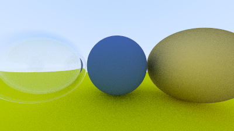

# C++ CPU Ray Tracer: Ray Tracing in One Weekend & The Next Week

A high-performance, header-only CPU Ray Tracer written in C++ based on Peter Shirley's acclaimed books: *Ray Tracing in One Weekend* and *Ray Tracing: The Next Week*. This project implements a fully functional ray tracer from scratch, demonstrating core computer graphics principles, vector mathematics, physical material behaviors, camera optics, and spatial optimization structures.

---

## 🚀 Key Features

- **Vector Mathematics Library (`vec3.h`, `color.h`, `ray.h`)**: Fully customized 3D vector, point, and color math implementation supporting addition, dot product, cross product, unit vectors, and ray reflection/refraction math.
- **Bounding Volume Hierarchy (`aabb.h`, `bvh.h`)**: Advanced spatial acceleration using Axis-Aligned Bounding Boxes (AABB) and a BVH tree structure, reducing rendering time from $O(N)$ to $O(\log N)$ for scene intersections.
- **Physical Materials (`material.h`)**:
  - **Lambertian (Diffuse)**: Realistic matte surfaces with cosine-weighted hemisphere sampling.
  - **Metal (Specular)**: Smooth mirror-like reflections with adjustable fuzziness.
  - **Dielectric (Glass)**: Refraction using Snell's Law and total internal reflection (TIR) using Schlick's approximation for Fresnel reflectivity.
- **Positionable Camera (`camera.h`)**: Supports adjustable field-of-view (FOV), look-at orientation controls, custom aspect ratios, and simulated physical lens settings like defocus blur (depth of field).
- **Anti-aliasing (`camera.h`)**: Built-in multi-sample anti-aliasing (MSAA) per pixel to remove jagged edges.
- **Interval Class (`interval.h`)**: Utility class to manage range tracking for ray intersections.

---

## 📂 Project Structure

```bash
├── src/                # Folder containing all C++ source and header files
│   ├── main.cpp        # Application entry point (sets up scene, camera, and triggers render)
│   ├── camera.h        # Camera class, MSAA sampling, viewport math, and render execution loop
│   ├── material.h      # Abstract material class and its derivatives (Lambertian, Metal, Dielectric)
│   ├── sphere.h        # Hittable spherical primitive
│   ├── hittable.h      # Base abstract class for interceptable objects
│   ├── hittable_list.h # Container class for scene objects
│   ├── aabb.h          # Axis-Aligned Bounding Box (AABB) representation for BVH
│   ├── bvh.h           # BVH acceleration node tree
│   ├── vec3.h          # Core 3D math wrapper for coordinates, directions, and color operations
│   ├── ray.h           # Ray model representation (Origin + Direction * t)
│   ├── color.h         # Color utilities and PPM formatting output
│   ├── interval.h      # Min/max utility ranges for ray calculations
│   └── rtweekend.h     # Common constants, utility functions, and random number generators
├── renders/            # Folder containing pre-rendered outputs (.ppm and .png) grouped by topic
│   ├── 01_background_sky/      # Gradient sky background
│   ├── 02_sphere_normals/     # Surface normal visualization (before/after)
│   ├── 03_diffuse_sphere/     # Diffuse materials
│   │   ├── shadow_acne/       # Before/after shadow acne fix comparison
│   │   ├── lambertian/        # Lambertian diffuse vs original diffuse comparison
│   │   └── sphere_on_grass/   # Diffuse sphere on grass
│   ├── 04_antialiasing/       # MSAA anti-aliasing comparison (before/after)
│   ├── 05_metal_materials/    # Metallic reflections with fuzziness (before/after)
│   ├── 06_glass_materials/    # Glass dielectrics
│   │   ├── refraction/        # Glass refraction
│   │   ├── total_internal_reflection/ # TIR comparison (before/after)
│   │   └── hollow_glass_sphere/       # Hollow glass bubble primitive
│   ├── 07_positionable_camera/# Camera positioning and custom field of view (vfov)
│   ├── 08_defocus_blur/       # Simulated physical lens depth-of-field
│   ├── 09_final_scene/        # Final complex scene render
│   └── 10_miscellaneous/      # Original / other testing renders
└── bin/                # Target directory for compiled binaries
```

---

## 🛠️ Compilation & Execution

This project is header-only and requires a C++ compiler supporting C++11 or higher.

### Compile
Compile the application with optimization flags (`-O3`) for fast performance:

```bash
g++ -O3 src/main.cpp -o bin/raytracer.exe
```

### Run
The main program redirects output directly to generate a PPM image file using `freopen`. Execute the compiled binary from the root directory:

```bash
./bin/raytracer.exe
```

This will output `final_scene.ppm` in the `renders/09_final_scene/` directory.

---

## 🖼️ Render Gallery (Milestones)

This repository includes several pre-rendered visual milestones showing progress through the ray tracer's development. Renders are organized inside their respective subconcept folders under the `renders/` directory:

### 🌌 Final Scene
*Defocus blur, 1200x675, 500 samples per pixel, BVH node hierarchy.*
*(Note: The raw PPM file was partially truncated; this preview displays the recovered portion).*


### 📸 Defocus Blur
*Camera depth-of-field focusing on three primary spheres.*


### 💎 Glass Materials (Refraction & Total Internal Reflection)
Comparison of dielectric glass spheres.
- **Glass Refraction**: Refraction of light using Snell's Law.
- **Total Internal Reflection (TIR)**: Light reflection at critical angles (before vs after comparison).
- **Hollow Glass Sphere**: A hollow bubble nested inside another dielectric sphere.

#### Glass Refraction


#### Total Internal Reflection (Before vs. After)
<p align="center">
  
  
</p>

#### Hollow Glass Sphere


### 🪙 Metal Spheres & Surface Roughness (Before vs. After)
*Metallic reflections showing the progress from pure specular reflection (Before Fuzz) to fuzzed specular reflection (After Fuzz).*

<p align="center">
  
  
</p>

### 🟢 Anti-aliasing Comparison (Before vs. After)
*Comparison showing the effect of multi-sample anti-aliasing (MSAA) on reducing jagged edges on the sphere border.*
*(Note: To keep the repository clean and save space, we only keep a single raw `.ppm` file (`renders/04_antialiasing/after_antialiasing.ppm`) for this step, but keep both converted PNG views).*

<p align="center">
  
  
</p>

---

## 🔄 PPM to PNG Image Converter

Since browsers and GitHub cannot natively display `.ppm` (Portable Pixmap) files, this repository includes a helper Python utility, [convert_ppm.py](file:///c:/Users/kondr/Desktop/ray_tracing/Week-2/convert_ppm.py).

This script:
1. Automatically scans the entire `renders/` directory and its subfolders for `.ppm` files.
2. Converts them into standard `.png` images in their respective subdirectories.
3. Automatically attempts to recover and pad truncated or interrupted renders (like `final_scene.ppm`) with black pixels so they can still be viewed.
4. Skips redundant conversions if the PNG file is already up to date.

### Usage
Ensure you have the Python `Pillow` library installed (`pip install Pillow`), then execute:

```bash
python convert_ppm.py
```
