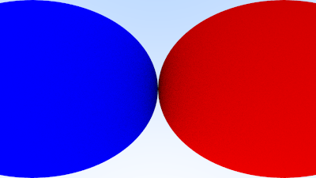
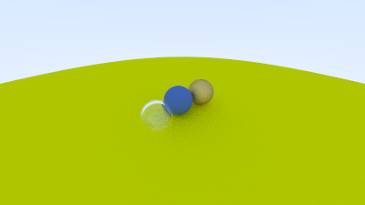
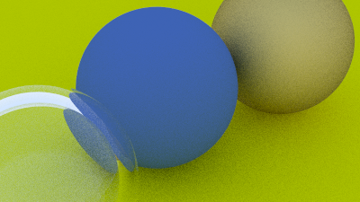
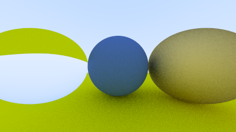
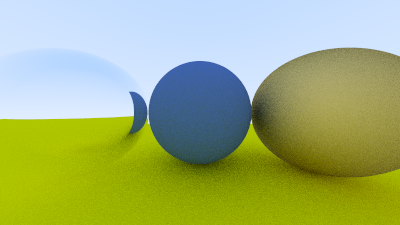
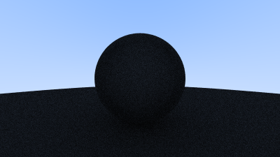
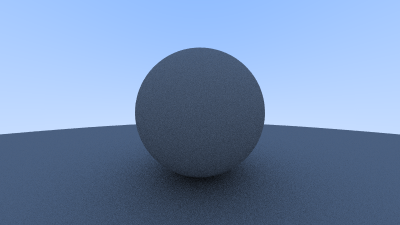

# C++ CPU Ray Tracer: Ray Tracing in One Weekend & The Next Week

A high-performance, header-only CPU Ray Tracer written in C++ based on Peter Shirley's acclaimed books: *Ray Tracing in One Weekend* and *Ray Tracing: The Next Week*. This project implements a fully functional ray tracer from scratch, demonstrating core computer graphics principles, vector mathematics, physical material behaviors, camera optics, and spatial optimization structures.

---

## 🚀 Key Features

- **Vector Mathematics Library (`vec3.h`, `color.h`, `ray.h`)**: Fully customized 3D vector, point, and color math implementation supporting addition, dot product, cross product, unit vectors, and ray reflection/refraction math.
- **Bounding Volume Hierarchy (`aabb.h`, `bvh.h`)**: Advanced spatial acceleration using Axis-Aligned Bounding Boxes (AABB) and a BVH tree structure, reducing rendering time from $O(N)$ to $O(\log N)$ for scene intersections.
- **Physical Materials (`material.h`)**:
  - **Lambertian (Diffuse)**: Realistic matte surfaces with cosine-weighted hemisphere sampling.
  - **Metal (Specular)**: Smooth mirror-like reflections with adjustable fuzziness.
  - **Dielectric (Glass)**: Refraction using Snell's Law and total internal reflection (TIR) using Schlick's approximation for Fresnel reflectivity.
- **Positionable Camera (`camera.h`)**: Supports adjustable field-of-view (FOV), look-at orientation controls, custom aspect ratios, and simulated physical lens settings like defocus blur (depth of field).
- **Anti-aliasing (`camera.h`)**: Built-in multi-sample anti-aliasing (MSAA) per pixel to remove jagged edges.
- **Interval Class (`interval.h`)**: Utility class to manage range tracking for ray intersections.

---

## 📂 Project Structure

```bash
├── src/                # Folder containing all C++ source and header files
│   ├── main.cpp        # Application entry point (sets up scene, camera, and triggers render)
│   ├── camera.h        # Camera class, MSAA sampling, viewport math, and render execution loop
│   ├── material.h      # Abstract material class and its derivatives (Lambertian, Metal, Dielectric)
│   ├── sphere.h        # Hittable spherical primitive
│   ├── hittable.h      # Base abstract class for interceptable objects
│   ├── hittable_list.h # Container class for scene objects
│   ├── aabb.h          # Axis-Aligned Bounding Box (AABB) representation for BVH
│   ├── bvh.h           # BVH acceleration node tree
│   ├── vec3.h          # Core 3D math wrapper for coordinates, directions, and color operations
│   ├── ray.h           # Ray model representation (Origin + Direction * t)
│   ├── color.h         # Color utilities and PPM formatting output
│   ├── interval.h      # Min/max utility ranges for ray calculations
│   └── rtweekend.h     # Common constants, utility functions, and random number generators
├── renders/            # Folder containing pre-rendered outputs (.ppm and .png) grouped by book chapters
│   ├── 02_output_an_image/             # Hello World color gradient
│   ├── 04_rays_simple_camera_background/# Blue-to-white sky gradient
│   ├── 05_adding_a_sphere/             # Red sphere hit test
│   ├── 06_surface_normals_multiple_objects/ # Normal vector coloring and multiple objects (sphere on grass)
│   ├── 08_antialiasing/                 # Supersampled antialiased sphere
│   ├── 09_diffuse_materials/            # Diffuse materials
│   │   ├── 01_first_diffusion/         # First diffuse sphere render (no shadow acne)
│   │   ├── 02_shadow_acne/             # Diffuse sphere with shadow acne
│   │   └── 03_lambertian/              # True Lambertian reflection rendering
│   ├── 10_metal/                        # Metal reflection (before/after fuzziness)
│   ├── 11_dielectrics/                  # Glass dielectrics
│   │   ├── 01_refraction/              # Light refraction
│   │   ├── 02_total_internal_reflection/ # Total Internal Reflection (TIR)
│   │   └── 03_hollow_glass_sphere/     # Hollow glass bubble primitive
│   ├── 12_positionable_camera/          # Positionable camera views (wide fov, custom position, zoom)
│   ├── 13_defocus_blur/                 # Depth of field (defocus blur)
│   └── 14_final_scene/                  # Final complex scene render
├── video/              # Folder containing final scene animation and its frames
│   ├── final_scene_animation.mp4        # Compiled MP4 animation of the final scene
│   └── frames/                          # Individual PPM frames (frame001.ppm to frame250.ppm)
└── bin/                # Target directory for compiled binaries
```

---

## 🛠️ Compilation & Execution

This project is header-only and requires a C++ compiler supporting C++11 or higher.

### Compile
Compile the application with optimization flags (`-O3`) for fast performance:

```bash
g++ -O3 src/main.cpp -o bin/raytracer.exe
```

### Run
The main program redirects output directly to generate a PPM image file using `freopen`. Execute the compiled binary from the root directory:

```bash
./bin/raytracer.exe
```

This will output `final_scene.ppm` in the `renders/14_final_scene/` directory.

---

## 🖼️ Render Gallery (Milestones)

This repository includes several pre-rendered visual milestones showing progress through the ray tracer's development. Renders are organized inside their respective chapter folders under the `renders/` directory:

### 🌌 Final Scene (Chapter 14)
*Defocus blur, 1200x675, 500 samples per pixel, BVH node hierarchy.*


### 🎥 Final Scene Animation (Chapter 14)
*An animated camera flythrough of the final scene, rendered as a 250-frame sequence.*

You can view the compiled animation here: [final_scene_animation.mp4](video/final_scene_animation.mp4)

To compile the animation from the individual frame files:
```bash
ffmpeg -framerate 25 -i video/frames/frame%03d.ppm -c:v libx264 -pix_fmt yuv420p video/final_scene_animation.mp4
```

### 📸 Defocus Blur (Chapter 13)
*Camera depth-of-field focusing on three primary spheres.*


### 📸 Positionable Camera (Chapter 12)
Configuring the camera with custom field of view (vfov) and looking positions.
- **Wide FOV**: Rendering with wide angle 90-degree field of view.
- **Positioned Camera**: Looking at the spheres from an angle.
- **Zoomed Camera**: Zooming into the scene with a narrower field of view (20 degrees).

<p align="center">
  
  
  
</p>

### 💎 Glass Materials (Chapter 11 - Dielectrics)
Comparison of dielectric glass spheres.
- **Glass Refraction**: Refraction of light using Snell's Law.
- **Total Internal Reflection (TIR)**: Light reflection at critical angles.
- **Hollow Glass Sphere**: A hollow bubble nested inside another dielectric sphere.

#### Glass Refraction


#### Total Internal Reflection (TIR)


#### Hollow Glass Sphere


### 🪙 Metal Spheres & Surface Roughness (Chapter 10 - Metal)
*Metallic reflections showing the progress from pure specular reflection (Before Fuzz) to fuzzed specular reflection (After Fuzz).*

<p align="center">
  
  
</p>

### 🟤 Diffuse Materials (Chapter 9)
Reorganization of diffuse materials rendering milestones.
- **First Diffusion**: First render of a diffuse sphere with hemispherical scattering (showing shadow acne).
- **Shadow Acne Fix**: Resolving the self-shadowing artifacts by ignoring intersections close to zero.
- **Lambertian Reflection**: True Lambertian reflection using cosine-weighted hemispherical distribution.

#### First Diffusion (with Shadow Acne)


#### Shadow Acne Fix


#### Lambertian Reflection


### 🟢 Anti-aliasing Comparison (Chapter 8 - Antialiasing)
*MSAA anti-aliasing render showing smooth sphere boundaries.*


---

## 🖼️ Viewing PPM Files

Since web browsers and standard OS image viewers cannot natively display `.ppm` (Portable Pixmap) files, you can view the raw `.ppm` files in this repository using:

1. **IrfanView**: A very fast, lightweight, and free image viewer for Windows that natively supports `.ppm` files out of the box (highly recommended).
2. **GIMP or Photoshop**: Popular graphics editors that fully support importing and exporting PPM images.
